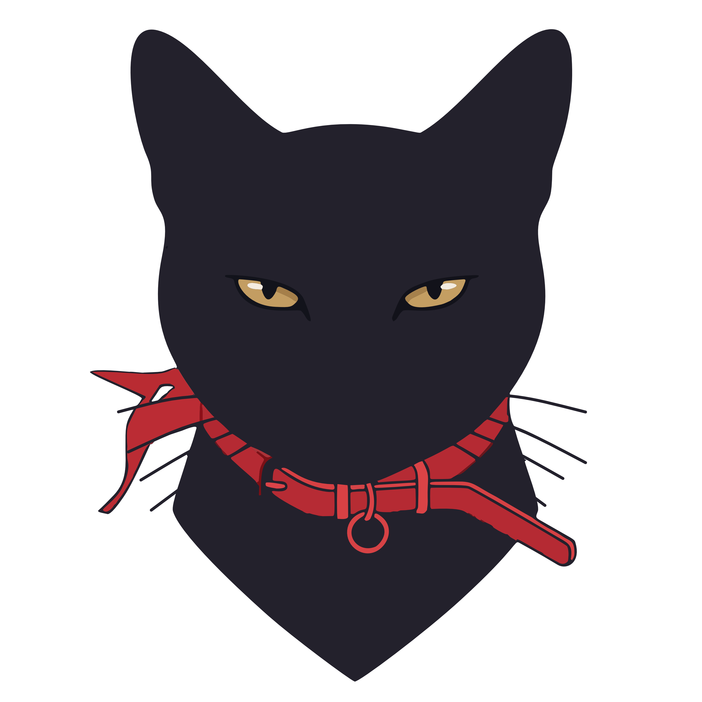

<p align="center">
  
</p>


<h1 align="center">Lanna</h1>

<p align="center">Lector de EPUB y PDF open source, multiplataforma.</p>

---

**Lanna** es un lector de libros electrónicos para Windows, macOS, Linux y Android,
con foco en:

- Fidelidad de renderizado de EPUB (tipografía, layout, notas al pie).
- Animaciones de paso de página cuidadas (curl / slide).
- Backup y sincronización de biblioteca + progreso de lectura vía Google Drive.

Estado: **Fase 0 — setup del proyecto.** Ver `ereader-flutter-plan_1.md` para el plan completo.

## Stack

| Capa | Tecnología |
|---|---|
| App | Flutter (Dart) |
| Motor EPUB | WebView + epub.js (`flutter_epub_viewer`) — Fase 1 |
| Motor PDF | `pdfx` / Syncfusion — Fase 3 |
| Almacenamiento local | SQLite vía `drift` |
| Estado | Riverpod |
| Router | `go_router` |
| Sync | Google Drive API + OAuth — Fase 4 |

## Requisitos de desarrollo

- Flutter SDK 3.47+ (`flutter doctor` sin errores)
- **Windows**: Visual Studio Build Tools con el workload "Desktop development
  with C++", el **WebView2 Runtime** (preinstalado en Windows 11) y **NuGet
  CLI** en el PATH (lo requiere `flutter_inappwebview_windows`)
- **Android**: Android SDK + JDK 17+ (cmdline-tools + licencias aceptadas)

## Cómo correr

```bash
flutter pub get
dart run build_runner build --delete-conflicting-outputs   # genera código de drift
flutter run -d windows      # o -d android
```

Regenerar íconos de la app tras cambiar el logo:

```bash
dart run flutter_launcher_icons
```

## Licencia

[GPL-3.0-or-later](LICENSE). Copyright © 2026 los contribuidores de Lanna.

Cualquier versión modificada que se distribuya debe publicarse también bajo GPL.

Fuentes empaquetadas: **Manrope** y **Newsreader**, ambas bajo SIL Open Font
License 1.1 (ver `assets/fonts/OFL-*.txt`).

Motor de lectura EPUB: **epub.js** (BSD-2-Clause) y **JSZip** (MIT),
empaquetados en `assets/reader/`.
